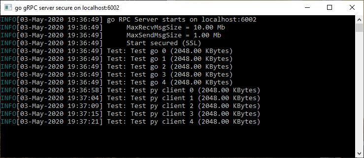
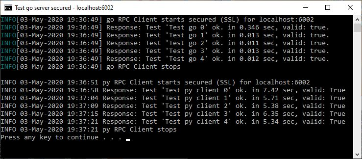
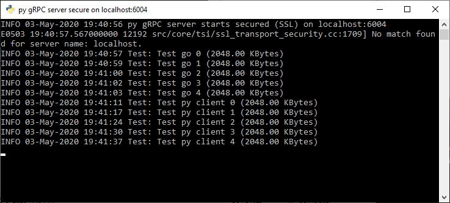
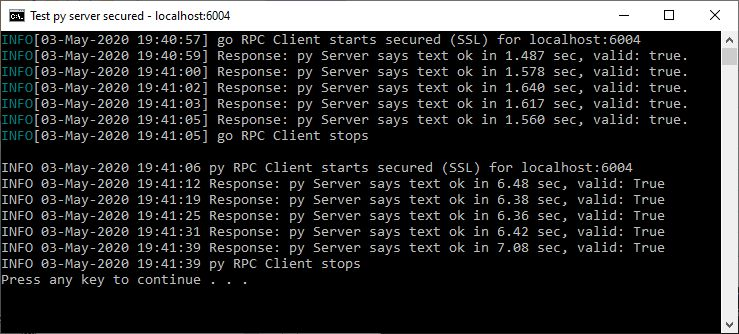

# Benchmark gRPC with golang and Python

Here we build and test two [gRPC](https://grpc.io/) servers, one in 
[golang](https://golang.org/) and another in 
[Python](https://www.python.org/).

The servers implements just one function, **Test1**.

A proto file define **Request** and **Response** message from **Test1** function:

```proto
syntax = "proto3";


option go_package = ".;service1";

service MyRPC1 {
    // just one function inside RPC server
    rpc Test1(Benchmark) returns(Response){}

}

message Response {
    string text = 1; // server text etsponse
    uint32 crc32 = 2; // computed crc32 of received buffer
}

message Benchmark {
    string name = 1; // test name
    bytes buffer = 2; // benchmark buffer
}

```

The [protoc compiler](https://github.com/protocolbuffers/protobuf/releases) generate "stub files" used to build the code.

The code import the "stub files", then the server implement **Test1** function and the client call the **Test1** function.

There are batch files (for Windows) used to generate "stub files" and to call the servers and clients, but the recipe also works in Linux with some minor changes.

The servers can use an [OpenSSL](https://www.openssl.org/) certificate, but the user authentification is not implemented.

The servers compute crc32 of received buffer and return it to client, 
the clients also compute crc32 of buffer and verify it.

## Calling the go server:

```cmd
SET HOST=localhost:6002
cd go-server
start "go gRPC server secure on %HOST%" go run . -host %HOST% -secured
```



## Both, go and py, clients call go server with block size 2048 KB:

```cmd
SET HOST=localhost:6002
SET BS=2048
SET N=5
title Test go server secured - %HOST%
cd go-client
go run . -host %HOST% -bs %BS% -n %N% -secured
cd ..\py-client-server
python client.py -host %HOST% -bs %BS% -n %N% -secured
pause
```



## Calling the python server:

```cmd
SET HOST=localhost:6004
start "py gRPC server secure on %HOST%" python server.py -host %HOST% -secured
```



## Both, go and py, clients call py server with block size 2048 KB:

```cmd
SET HOST=localhost:6004
SET BS=2048
SET N=5
title Test py server secured - %HOST%
cd go-client
go run . -host %HOST% -bs %BS% -n %N% -secured
cd ..\py-client-server
python client.py -host %HOST% -bs %BS% -n %N% -secured
pause
```


